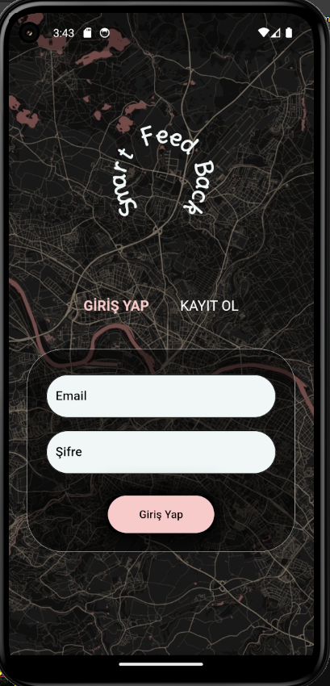
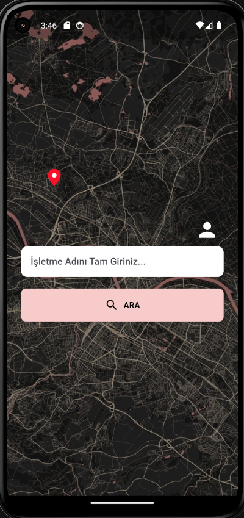
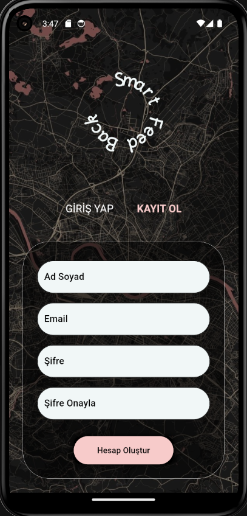
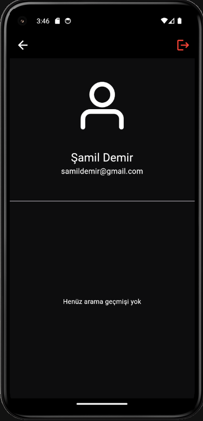
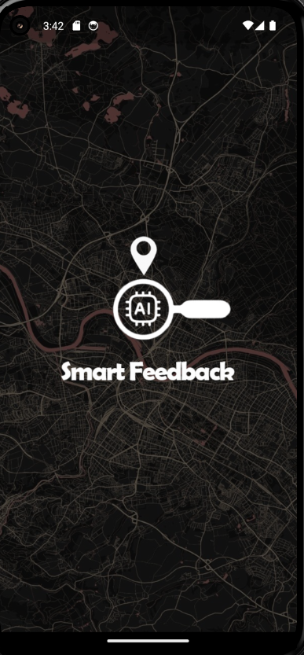

# Smart FeedBack

Bu proje, işletmelere gelen müşteri yorumlarını analiz eden ve yapay zeka desteğiyle geri bildirim sağlayan bir mobil uygulamadır.  
Amaç, işletmelerin müşteri deneyimini geliştirmesine yardımcı olmaktır. 🚀

## Özellikler
- Google Places API ile işletme yorumlarını çekme
- OpenAI API ile yorumların analiz edilmesi
- Firebase ile kimlik doğrulama ve veritabanı desteği
- Flutter ile mobil uygulama geliştirme (Android & iOS)

## Kurulum
1. Repo’yu klonla:
   ```bash
   git clone https://github.com/SamilDemirr/Smart-FeedBack-Flutter.git

2. Gerekli paketleri yükle:
  flutter pub get

3. " .env " dosyası oluştur ve API keylerini gir (örnek için .env.example dosyasına bak).

## Kullanılan Teknolojiler
- Flutter
- Firebase
- Google Places API
- OpenAI API

## Ekran Görüntüleri

### Giriş Ekranı


### Anasayfa


### Kayıt Ekranı


### Profil Ekranı


### Splash Ekranı


